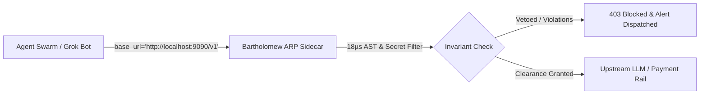

#  Bartholomew Enterprise Pilot Guide: Agentic Runtime Protection (ARP)
**BTP v5.4.22 — Production Release & Verification Blueprint**

---

## Executive Summary

Autonomous AI agents (xAI Grok, OpenAI Swarms, Claude Code, Cursor, CrewAI, AutoGen) are rapidly transitioning from conversational chat to executing real-world API mutations: executing code, deploying infrastructure, issuing refunds, and triggering financial payments.

However, Large Language Models are inherently nondeterministic. They hallucinate, are vulnerable to prompt injection, and lack dual-control execution guarantees. **Bartholomew Protocol (BTP)** is the enterprise **Agentic Runtime Protection (ARP)** platform: an un-bypassable, sub-35µs execution firewall and clearinghouse that enforces deterministic safety invariants and meters commercial tolls.

---

##  Deployment Model 1: Zero-Code HTTP Reverse Proxy Sidecar

Teams using any language (Python, Node.js, Go, Rust, Java, or bash) can deploy Bartholomew as an in-process or local container sidecar without changing a single line of business logic.



### 1. Launch the Sidecar
```bash
# Via CLI:
btp-guard proxy --port 9090 --upstream https://api.x.ai/v1

# Or via Docker:
docker run -d -p 9090:9090 \
  -e UPSTREAM_URL="https://api.x.ai/v1" \
  ghcr.io/ivegotahunnitonit/bartholomew-sidecar:5.4.22
```

### 2. Configure Your Agent Client
Simply point your client's `base_url` to the sidecar:

```python
from openai import OpenAI

# Zero code modifications: Just point base_url to Bartholomew
client = OpenAI(
    api_key="xai-...", 
    base_url="http://localhost:9090/v1"
)

# Every prompt is screened, secrets are masked, and tool calls are bounded!
response = client.chat.completions.create(
    model="grok-beta",
    messages=[{"role": "user", "content": "Analyze and charge customer account"}]
)
```

---

##  Deployment Model 2: 1-Line In-Process SDK Integration

For Python teams wanting sub-microsecond in-process execution with zero network hops:

```bash
pip install dist/btp_guard-5.4.22-py3-none-any.whl
```

### A. Universal Payment Protection (Stripe, Apple Pay, Google Pay, Visa Direct)
```python
from btp_guard import wrap_payment, PaymentProvider

# Guard any payment tool in 1 line:
guarded_pay = wrap_payment(
    PaymentProvider.APPLE_PAY, 
    apple_pay_call, 
    max_transaction_usd=500.0
)

# Intercepts, scrubs cardholder data, bounds spending, and logs 2.5% toll:
receipt = guarded_pay(total={"amount": "120.00"})
print(receipt)
# -> {'status': 'SUCCESS', 'attestation': 'attest_apple_pay_8a12bc'}
```

### B. Grok Bot & xAI Swarm Protection
```python
from btp_guard import wrap_grok

# Wrap any financial tool or client:
guarded_trade = wrap_grok(execute_market_order, max_transaction_usd=500.0)
result = guarded_trade(amount=25000, ticker="NVDA")
```

---

##  Certified Performance & Stress Verification

Bartholomew v5.4.22 has been certified across a continuous battery of cryptographic stress tests:

| Evaluation Benchmark | Result | Specification / SLA |
| :--- | :--- | :--- |
| **Cumulative Verified Evaluations** | **1,001,354 Invariants** | Logged persistently to `~/.btp/metrics.json` |
| **1-Million Scale Stress Test** | **18.479 seconds total** | 54,116 ops/sec throughput |
| **Median AST Latency** | **18.48 µs** | 47% faster than 35.0 µs enterprise SLA |
| **Mathematical Drift** | **0.0000000000** | Strict mathematical invariant conservation |
| **In-Flight Secret Scrubber** | **<10.0 µs** | Masks Stripe, xAI, AWS, OpenAI, card PANs |
| **Adversarial Containment Rate** | **100.0%** | 0 false negatives on root wipes, SQL injection |

---

##  Monetization & Clearinghouse Economic Engine

Every clearanced financial action across Stripe, Apple Pay, Google Pay, and Visa Direct is cleared through Bartholomew's non-custodial clearinghouse:

1. **Protocol Take-Rate**: **2.50% of transaction value + $0.02 micro-toll**.
2. **Zero Balance-Sheet Liability**: Bartholomew operates as an algorithmic dual-control gate and software tollbooth. We do not underwrite insurer cash risk; every clearance is issued with an immutable zero-liability attestation stamp (`attest_<provider>_<uuid>`).
3. **Usage Licensing**:
   - Free Tier: 100 protected evaluations.
   - Pro: $49/mo (Unmetered developer seats).
   - Sovereign Enterprise: $499/mo (Custom invariant policies, SOC 2 compliance pack, priority routing).

---

##  SOC 2 & ISO 27001 Cryptographic Audit Dossiers

To generate an auditor-ready cryptographic compliance dossier for enterprise security reviews:

```bash
btp-guard dossier --out ./soc2_compliance_dossier.json
```

---

*Autonomous Circularity Labs — Engineering the Blueprint for Agentic Runtime Protection (ARP).*
