# Bartholomew Protocol — 30-Day Hands-On Team Pilot
**Verifiable Workspace Guardrails for Teams Adopting AI Coding Agents**

---

## 1. The Core Problem We Solve

Teams adopting AI coding agents (Claude Code, Cursor, Windsurf, GitHub Copilot CLI, or custom autonomous agents) face a fundamental dilemma:

> **"We want our developers moving 5x faster with agents, but we cannot afford an agent executing unauthorized terminal commands, leaking credentials into prompt logs, or pushing unverified code to git."**

Generic "AI safety" benchmarks and cloud-based prompt filters don't solve this. You need a **deterministic local boundary** at the exact millisecond an agent is about to touch your files, terminals, or git history.

---

## 2. The Concrete Outcome

Bartholomew provides a fail-closed execution firewall that lives in the developer's workspace and terminal. Within 30 days, we deliver:

1. **Deterministic Workspace Boundary**: Block destructive shell commands (`rm -rf`, disk wipes, fork bombs) and secret exposure in under 35 microseconds.
2. **Team-Wide Policy Synchronization**: Enforce one coherent security policy (`.btp/policy.yaml`) across all developer IDEs and terminal environments.
3. **Fail-Closed Git & CI Protections**: Prevent unverified agent-authored commits from entering your branches.
4. **CISO & SOC 2 Audit Dossier**: Produce cryptographically signed execution receipts proving every tool action was evaluated and logged.

---

## 3. Pilot Scope & Pricing

| Term | Detail |
| :--- | :--- |
| **Duration** | **30 Calendar Days** |
| **Team Size** | **Up to 10 Engineers** |
| **Pilot Investment** | **$950 one-time** *(or $199/month on an ongoing basis)* |
| **Target Audience** | Engineering Leads, Platform Teams, and DevSecOps Directors |
| **Our Guarantee** | **100% Full Refund** if Bartholomew fails to intercept an unauthorized action or introduces noticeable latency into developer workflows. |

---

## 4. 30-Day Execution Timeline

```mermaid
gantt
    title Bartholomew 30-Day Pilot Schedule
    dateFormat  X
    axisFormat Day %d
    section Phase 1: Baseline
    Kickoff & Custom Policy Definition   :active, p1, 0, 3
    Pre-commit & IDE Hook Enrollment     :p2, 3, 7
    section Phase 2: Live Guard
    Silent Auditing & Tuning             :p3, 7, 14
    Active Enforcement & Secret Scrubbing:p4, 14, 25
    section Phase 3: Deliverables
    CISO Audit Dossier Generation        :p5, 25, 28
    Executive Readout & Transition       :p6, 28, 30
```

* **Week 1 (Setup & Enrollment)**:
  * 30-minute engineering walkthrough.
  * Baseline repo inspection using `btp-guard prove`.
  * Customized `.btp/policy.yaml` tailored to your stack (Node, Python, Go, Rust).
* **Week 2–3 (Live Active Enforcement)**:
  * In-process AST inspection armed across all developer machines.
  * Zero developer disruption: sub-35µs evaluation latency on routine builds, tests, and git actions.
  * Real-time interception of prohibited commands or secret exposures.
* **Week 4 (Audit Dossier & Executive Presentation)**:
  * Export of the cryptographic ledger evidence pack (`btp-guard audit --format json`).
  * Executive readout summarizing:
    * Total tool proposals evaluated.
    * Threats/invariants intercepted.
    * Signed compliance trail ready for SOC 2 Type II or ISO 27001 auditor review.

---

## 5. Commercial Conversion Path

At Day 30, the team has proven three things:
1. Coding agents can run freely without risk of catastrophic terminal mistakes.
2. Routine developer workflows experience zero slowdown.
3. Management possesses an auditable paper trail.

**Ongoing Team Subscription**:
* **$199 / month** for up to 10 engineers ($20/seat/mo thereafter).
* Includes centralized audit aggregation, policy push updates, and priority enterprise support.

---

## Contact & Pilot Enrollment

To initiate an onboarding pilot for your team:
* **Email**: `founders@bartholomew.info`
* **CLI Self-Enrollment**: `python -m btp_guard.cli pilot --enroll`
* **Direct Pilot Scheduling**: [https://bartholomew.info/pilot](https://bartholomew.info/pilot)
