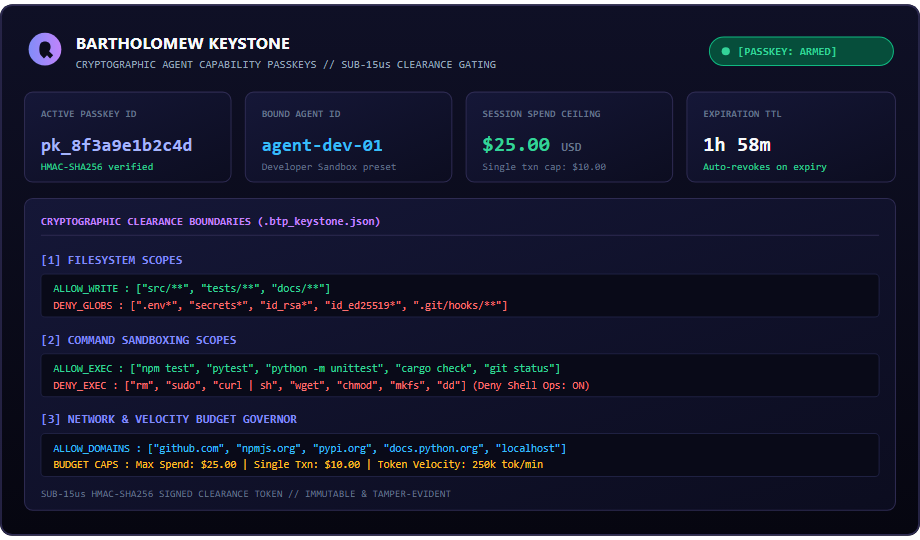

# Bartholomew Keystone - Cryptographic Agent Capability Passkeys

> **Issue tamper-evident, cryptographically signed permission slips for autonomous AI agents.**  
> *Define deterministic boundaries for file modifications, command executions, external network calls, and financial spend in Cursor, Claude Desktop, Windsurf, and VS Code.*

[](https://open-vsx.org/extension/Bartholomew/bartholomew-keystone)
[](https://open-vsx.org/extension/Bartholomew/bartholomew-guard-vscode)
[](https://pypi.org/project/btp-guard/)
[](https://www.npmjs.com/package/btp-guard)
[](https://opensource.org/licenses/MIT)

---

## The Problem Keystone Solves

Autonomous AI coding agents (such as Cursor Agent, Claude Code, Cline, Windsurf, Devin, GitHub Copilot Workspace, and MCP tool runners) operate with broad system privileges. If an agent receives instructions containing an indirect prompt injection, or hallucinates during an automated refactoring loop, it can:

1. **Destroy files or git history** (`rm -rf`, destructive resets, overwriting production configs).
2. **Exfiltrate secrets and credentials** (reading `.env`, `.ssh/id_rsa`, AWS/GCP keys and transmitting via `curl`).
3. **Run out-of-scope system commands** (modifying permissions, installing malware, spawning unauthorized processes).
4. **Trigger unchecked financial costs** (calling billable APIs or Cloud services without budget boundaries).

System prompt instructions ("Please do not touch `.env`") are easily ignored or circumvented by prompt injections. **Bartholomew Keystone** enforces hard, deterministic cryptographic clearance boundaries at the tool execution seam.

---

## Keystone Core Visual

### Active Cryptographic Clearance & Scopes
Visualizing active capability boundaries: $25.00 session spend ceiling, 2-hour temporal TTL, filesystem write restrictions, command sandboxing whitelists, and network egress controls.



---

## Guard vs. Keystone - How They Work Together

| Layer | Bartholomew Guard | Bartholomew Keystone (This Extension) |
|---|---|---|
| **Primary Role** | Invariant & Leak Detection | Cryptographic Capability Scoping |
| **How It Operates** | AST static analysis & runtime leak scanning | Issues and verifies signed capability passkeys |
| **Protection Focus** | Zero-leak credential guard, prompt-injection AST gate | Defines exact file globs, commands, domains, and budget limits |
| **Speed** | Sub-25 microseconds in-process verification | Sub-15 microseconds HMAC-SHA256 signature and scope check |
| **Installation** | Companion extension (`Bartholomew.bartholomew-guard-vscode`) | You are here (`Bartholomew.bartholomew-keystone`) |

---

## Core Clearance Scopes

When a Keystone Passkey is issued, the agent receives an ephemeral `.btp_keystone.json` token signed by the local authority. Every proposed action is evaluated against these scopes:

### 1. Filesystem Containment (`files`)
- **`allow_read`**: Globs the agent may inspect (e.g. `["src/**", "tests/**", "docs/**"]`).
- **`allow_write`**: Globs the agent is authorized to modify. Any write outside these paths is rejected instantly.
- **`deny`**: Blacklisted patterns strictly blocked from reading or writing (e.g. `.env*`, `secrets*`, `id_rsa*`, `.git/hooks/**`).
- **`max_file_size_kb`**: Maximum permissible file write payload to prevent repository bloat or disk exhaustion.

### 2. Command Sandboxing (`commands`)
- **`allow_exec`**: Safe execution whitelist (e.g. `npm test`, `pytest`, `cargo check`, `git status`).
- **`deny_exec`**: Destructive and dangerous commands blocked unconditionally (e.g. `rm`, `sudo`, `curl`, `wget`, `chmod`, `dd`, `mkfs`).
- **`deny_shell_operators`**: Prevents command chaining injections (`&&`, `||`, `;`, `|`, `` ` ``, `$()`).

### 3. Network and API Gating (`network`)
- **`allow_domains`**: Whitelist of permitted external egress destinations (e.g. `github.com`, `registry.npmjs.org`, `pypi.org`, `localhost`).
- **`deny_domains`**: Prohibited exfiltration endpoints.
- **`allow_search`**: Controls whether web search tool capabilities are enabled.

### 4. Financial and Velocity Ceilings (`budget`)
- **`max_spend_usd`**: Cumulative session ceiling for paid tool calls, inference APIs, or cloud resources ($25.00 default).
- **`max_per_txn_usd`**: Hard cap on any single transaction ($10.00 default).
- **`max_tokens`**: Token velocity limiter preventing runaway infinite loops.

### 5. Temporal Validity and Non-Repudiation (`temporal` & `receipts`)
- **TTL Expiry**: Automatic invalidation after session duration (default: 120 minutes).
- **Audit Receipts**: Every evaluation produces a deterministic SHA-256 receipt hash for SOC 2 and audit log traceability.

---

## How-To Guide: Step-by-Step Instructions

### Step 1: Installation

#### In VS Code, Cursor, or Windsurf
1. Open the Extensions pane (`Ctrl+Shift+X` or `Cmd+Shift+X`).
2. Search for **`Bartholomew Keystone`**.
3. Click **Install**.

#### Via Extensions CLI
```bash
# In VS Code:
code --install-extension itsubsolomon.bartholomew-keystone

# In Cursor:
cursor --install-extension Bartholomew.bartholomew-keystone

# Via Open VSX Registry:
# https://open-vsx.org/extension/Bartholomew/bartholomew-keystone
```

---

### Step 2: Issue an Agent Capability Passkey

1. Press `Ctrl+Shift+P` (or `Cmd+Shift+P` on macOS) to open the Command Palette.
2. Select **`Keystone: Issue Agent Capability Passkey`**.
3. Choose a clearance preset tailored to your workflow:
   - **`Developer Sandbox (Recommended)`**:
     * Files: Read workspace, write only `src/**`, `tests/**`, `docs/**`.
     * Commands: Sandboxed to `npm test`, `pytest`, `cargo check`, `git status`.
     * Spend Ceiling: $25.00 session limit, $10.00 single transaction cap.
     * Expiration: 2 hours TTL.
   - **`Read-Only Auditor`**:
     * Read-only workspace inspection.
     * All writes and terminal command executions blocked.
     * Spend Ceiling: $0.00.
   - **`Custom Clearance Profile`**:
     * Interactively define specific write directories, command whitelists, and spend limits.
4. Keystone generates a signed `.btp_keystone.json` token and arms the status bar.

---

### Step 3: Inspect Active Agent Clearance

To verify active capability boundaries and remaining session allowances:

1. Open the Command Palette (`Ctrl+Shift+P`).
2. Run **`Keystone: Inspect Active Agent Clearance`**.
3. A detailed breakdown displays:
   - Passkey ID and signature verification status.
   - Remaining session TTL.
   - Authorized file write globs and denied patterns.
   - Whitelisted commands and denied binaries.
   - Current session spend vs. budget ceiling.

---

### Step 4: Validate Proposed Actions in Real Time

You can test whether a proposed command or file write falls within active agent privileges:

1. Open the Command Palette (`Ctrl+Shift+P`).
2. Select **`Keystone: Validate Agent Action against Passkey`**.
3. Enter the test command (e.g. `rm -rf tmp/`) or file path (e.g. `src/index.ts`).
4. Keystone evaluates the action against your clearance rules in under 15 microseconds and returns the verdict:
   - `[ALLOW] Action matches active clearance scopes.`
   - `[DENY] Action violates command sandbox policy (prohibited binary: rm).`

---

### Step 5: Revoke Agent Privileges Instantly

To immediately freeze all agent permissions:

1. Press `Ctrl+Shift+P`.
2. Run **`Keystone: Revoke Current Agent Passkey`**.
3. The cryptographic passkey is permanently destroyed, disarming agent write and execution capabilities instantly.

---

## Extension Commands Reference

| Command | Identifier | Description |
|---|---|---|
| `Keystone: Issue Agent Capability Passkey` | `keystone.issuePasskey` | Issue a signed agent capability passkey with presets |
| `Keystone: Inspect Active Agent Clearance` | `keystone.inspectClearance` | View active agent privileges, expiration, and spend limits |
| `Keystone: Revoke Current Agent Passkey` | `keystone.revokePasskey` | Instantly strip agent privileges and delete active passkey |
| `Keystone: Validate Agent Action against Passkey` | `keystone.validateAction` | Test a proposed command or file path against current clearance |
| `Keystone: View Clearance Audit Receipts` | `keystone.auditReceipts` | View recent cryptographic clearance decision receipts |
| `Keystone: Open Clearance Dashboard` | `keystone.openDashboard` | Opens interactive capability status & spend monitor |

---

## Open Source and Compliance

Bartholomew Keystone is **MIT licensed** and engineered for zero-trust agentic enterprise architectures.

- Documentation: [https://bartholomew.info](https://bartholomew.info)
- Guard Extension: [Open VSX Registry](https://open-vsx.org/extension/Bartholomew/bartholomew-guard-vscode)
- Python Package: `pip install btp-guard`
- NPM Package: `npm install btp-guard`
